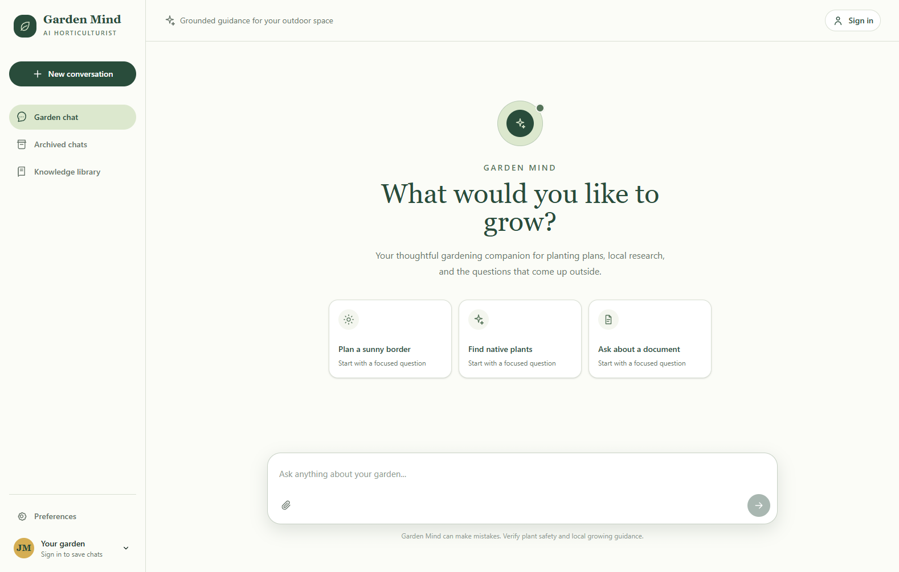

# Garden Mind

## Desktop Preview

<!--  -->

## About

Garden Mind is an AI-powered gardening and outdoor-living assistant that helps
users plan gardens, care for plants, troubleshoot common problems, and make
informed decisions about their outdoor spaces. The application combines a
responsive React interface with a FastAPI backend and Hugging Face language
model inference to provide practical, safety-conscious conversational guidance.

Users can also attach PDF, DOCX, Markdown, and text documents for temporary,
session-only context in their questions. Garden Mind is actively under
development as new capabilities and improvements are explored.

## Technical Overview

### Stack

- **Frontend:** React, TypeScript, Vite, and Tailwind CSS
- **Backend:** Python and FastAPI
- **AI inference:** Hugging Face Inference API with
  `meta-llama/Llama-3.1-8B-Instruct:novita`
- **Document processing:** LangChain community document loaders, PyPDF, and
  docx2txt
- **Deployment:** Vercel, with the Vite application and FastAPI serverless API
  connected through `/api/*` rewrites

### How AI Responses Work

The React client sends a gardening question and a bounded recent conversation
history to the FastAPI API. The API adds a gardening and outdoor-living system
prompt, then requests a response from the Llama model through Hugging Face.
Model access is configured only on the server with environment variables; no
provider credentials are exposed to the browser or committed to this repository.

The interface supports plain-language formatting, including paragraphs, bullet
lists, and numbered steps. It also displays source filenames when an answer
uses an attached document.

### Temporary Document Context

Users can attach PDF, DOCX, Markdown, or plain-text files up to 10 MB. The API
extracts readable text, limits the returned context to 12,000 characters, and
sends that context back to the active browser session. For subsequent
questions, the browser includes the bounded text with the chat request so the
LLM can use it as reference material.

Documents, extracted text, and chat history are not stored in a database,
object store, or persistent server-side index. They are discarded on browser
refresh, tab close, deployment restart, or attachment removal.

### Safety Guardrails

- Direct user messages and recent history are screened for common
  prompt-injection patterns before reaching the model.
- Uploaded document text is labeled as untrusted reference material, and the
  model is instructed not to follow instructions found inside a document.
- The system prompt constrains responses to gardening and outdoor living,
  redirects unrelated requests, and includes safety guidance for chemicals,
  pets, pollinators, fire, construction, utility lines, permits, and urgent
  health concerns.
- Conversation history, document context, and model output length are bounded
  to keep requests focused and limit unnecessary inference usage.
